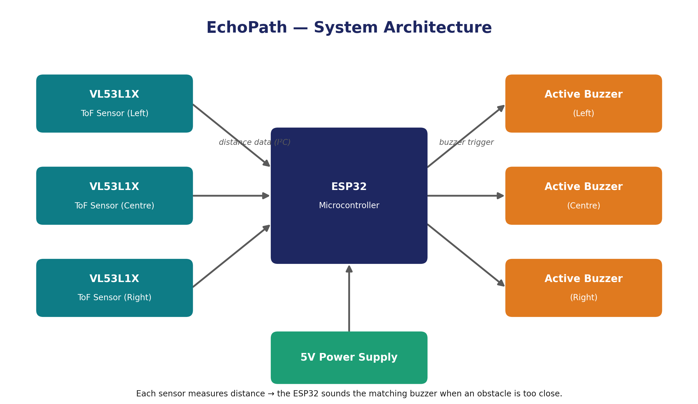
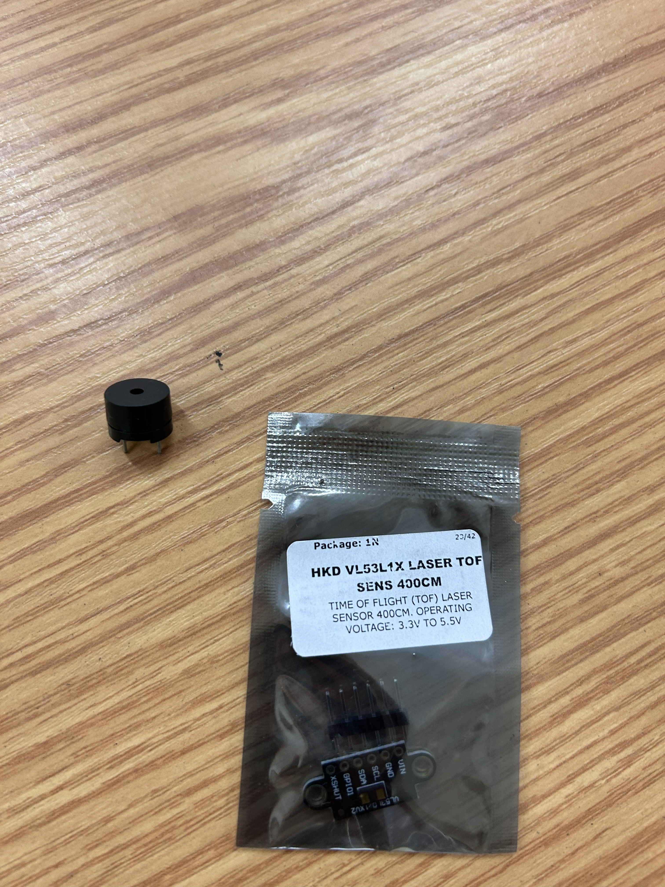
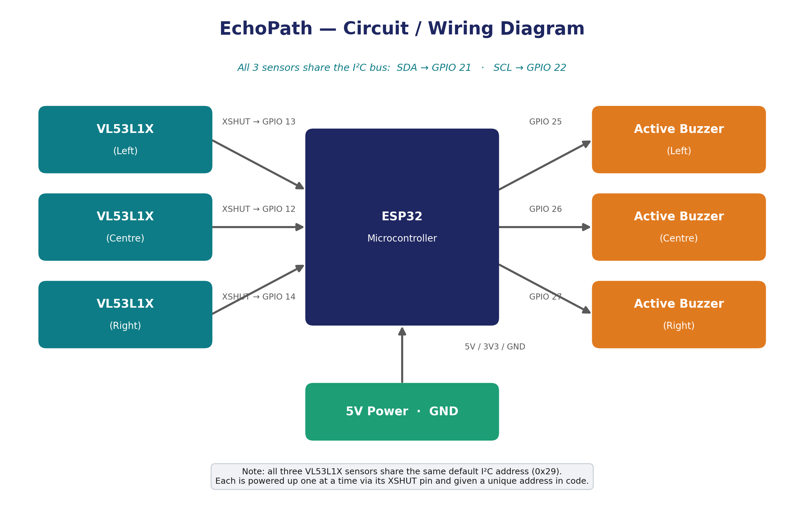
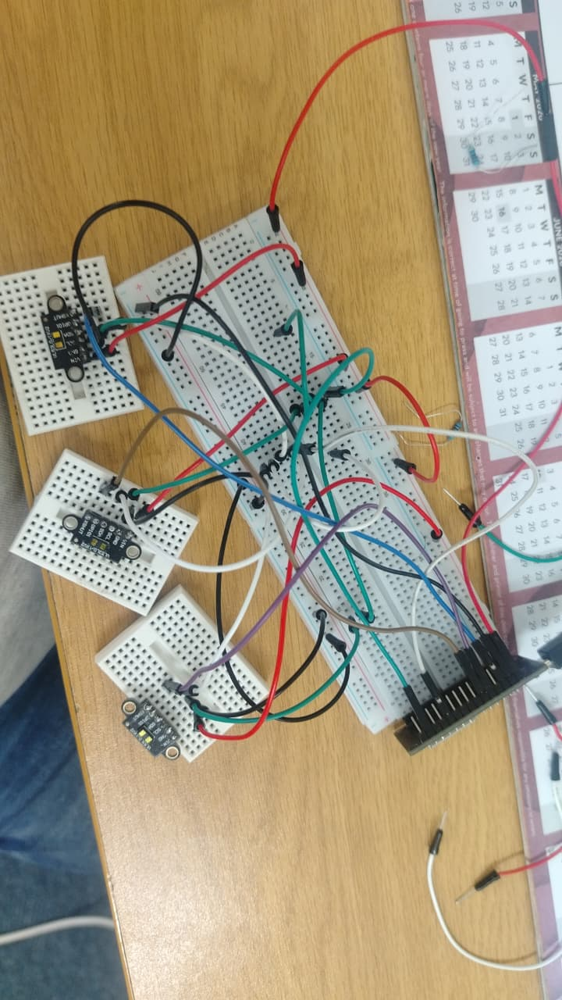
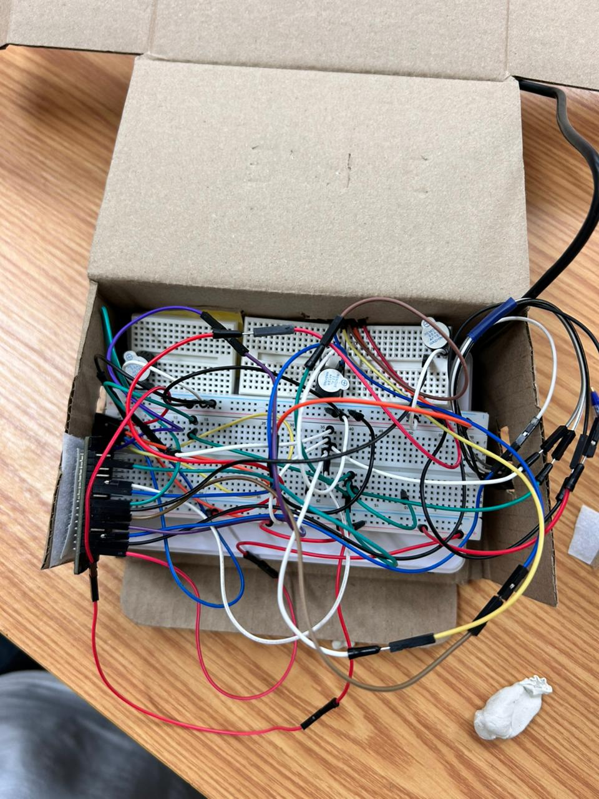

# 🌐 EchoPath — IoT Elective Project 2026
### Cape Peninsula University of Technology — IT Diploma
**Module:** Internet of Things (IoT) Elective | **Year:** 2026

---

## 📋 Table of Contents

1. [Project Overview](#-project-overview)
2. [Group Members](#-group-members)
3. [Project Idea & Problem Statement](#-project-idea--problem-statement)
4. [System Architecture & Design](#-system-architecture--design)
5. [Development Roadmap (Stages 0–12)](#-development-roadmap-stages-012)
6. [Hardware Components](#-hardware-components)
7. [Software & Technologies](#-software--technologies)
8. [Circuit Diagram / Wiring](#-circuit-diagram--wiring)
9. [Build Process (with photos)](#-build-process-with-photos)
10. [Code Documentation](#-code-documentation)
11. [Testing & Results](#-testing--results)
12. [Challenges & Solutions](#-challenges--solutions)
13. [Project Demonstration](#-project-demonstration)
14. [References](#-references)
15. [Assessment Rubric](#-assessment-rubric)
16. [Embedding Images in Your README](#-embedding-images-in-your-readme)

---

## 📌 Project Overview

**Project Title:** `EchoPath — Wearable Obstacle Detection for Visually Impaired Users`
**Group Name / Number:** `Built Different`
**Presentation Date:** 20 May 2026 — 10:00 to 15:00 (SAST)

EchoPath is a wearable assistive device that helps visually impaired people sense obstacles around them in real time. Three laser distance sensors (left, centre, right) constantly measure how far away nearby objects are, and three small buzzers give the wearer instant audio feedback telling them which direction an obstacle is coming from — all hands-free and without needing sight.

### 📁 Repository Structure

```
iot-elective-project-2026-built-different/
├── code/echo_path/   → ESP32 firmware (the EchoPath program)
├── docs/             → Project documentation and supporting files
├── images/           → Diagrams and build photos used in this README
└── README.md         → This file
```

---

## 👥 Group Members

| Student Name | Student Number | Role / Responsibility |
|---|---|---|
| Charlton Solomons | 220483418 | Hardware Lead |
| Witcha Francisco | 222894822 | Software Lead |
| Nolwazi Zulu | 220118876 | Documentation Lead |
| Lesego Tshabalala | 240263952 | Testing Lead |

---

## 💡 Project Idea & Problem Statement

### Problem Statement
> Visually impaired people face daily danger when moving around: low walls, poles, open doors, parked cars, and people stepping into their path are hard or impossible to detect with a traditional white cane alone, especially objects at chest or head height. Existing electronic aids are often expensive, bulky, or need both hands. There is a need for an affordable, hands-free device that warns the user about obstacles and tells them which direction the obstacle is on.

### Proposed Solution
> EchoPath solves this with three Time-of-Flight (ToF) laser sensors mounted to face left, centre, and right. Each sensor continuously measures the distance to whatever is in front of it. When an obstacle comes within a set danger range, the buzzer matching that direction sounds — so the wearer immediately knows whether the obstacle is to their left, straight ahead, or to their right. The whole system runs on a low-cost ESP32 microcontroller and is designed to move from a breadboard prototype into a lightweight, face-mounted wearable.

### Objectives
- [x] Detect obstacles in three directions (left / centre / right) in real time using VL53L1X ToF sensors
- [x] Give immediate directional audio feedback through three separate buzzers
- [x] Run the full system on a single low-cost ESP32 microcontroller
- [ ] Move from the breadboard prototype to a portable, face-mounted wearable
- [x] Add silent haptic (vibration) feedback and an ESP32-CAM in Phase 2

---

## 🏗️ System Architecture & Design



> **Data flow:** `3 × VL53L1X sensors (Left / Centre / Right)` → *shared I²C bus* → `ESP32 microcontroller` → `3 × active buzzers (Left / Centre / Right)`, powered by a `5 V supply`. The ESP32 reads each sensor's distance many times per second and sounds the matching buzzer whenever an obstacle enters the danger range.

### Design Decisions
- **ESP32 as the controller** — chosen over the Arduino Uno because it is faster, has built-in Wi-Fi/Bluetooth, and leaves room for the Phase 2 ESP32-CAM and wireless features. The Arduino Uno is kept only as a backup/testing board.
- **Audio buzzers for feedback** — directional buzzers (left/centre/right) give clear, instant cues without the user needing to look at anything. Vibration motors were deferred to Phase 2 as a quieter, "silent haptic" option.
- **Three separate sensors** — using one sensor per direction gives true directional resolution (the user can tell which side the obstacle is on), instead of a single "something is near" warning.
- **Breadboard prototype first** — building on breadboards makes it easy to test and rewire before committing to the final face-mounted, battery-powered version.

---

## 🧭 Development Roadmap (Stages 0–12)

Our build is planned as a staged roadmap, from first proof of concept through to a field-tested wearable. The status column shows where we currently are.

> **Status key:** ✅ Done · 🔄 In progress · ⏳ Planned

| Stage | Name | Focus | Status |
|---|---|---|---|
| 0 | Proof of Concept | Arduino Uno validation | ✅ Done |
| 1 | Breadboard Prototype | ESP32 + 3 sensors | ✅ Done |
| 2 | I²C Addressing | Unique addresses per sensor | ✅ Done |
| 3 | Audio Integration | Active buzzers | ✅ Done |
| 4 | Haptic Integration | Vibration motors | ✅ Done |
| 5 | Threshold Calibration | Distance tuning | 🔄 In progress |
| 6 | Mechanical Assembly | Face mounting | 🔄 In progress |
| 7 | Enclosure | Component housing | 🔄 In progress |
| 8 | Cable Management | Wire routing | 🔄 In progress |
| 9 | Power System | Battery + boost converter | ⏳ Planned |
| 10 | Integration Testing | Full system validation | ⏳ Planned |
| 11 | Field Testing | Real-world navigation | ⏳ Planned |
| 12 | Iteration | Improvements & refinements | ⏳ Planned |

> 📌 Update the **Status** column as your group completes each stage.

---

## 🔧 Hardware Components

| Component | Description | Quantity | Purpose |
|---|---|---|---|
| VL53L1X ToF Sensor | Laser Time-of-Flight distance sensor, range up to 400 cm, 3.3–5.5 V | 3 | Measure obstacle distance left, centre, right |
| ESP32 (Dev Board) | Microcontroller with Wi-Fi / Bluetooth | 1 | Reads the sensors and drives the buzzers |
| Active Buzzer | Sound-alert module | 3 | Directional audio feedback (L / C / R) |
| Vibration Motor | Vibration-alert module | 3 | Directional haptic feedback (L / C / R) |
| Power Supply | 5 V source | 1 | Powers the system |
| Full-size Breadboard | Prototyping board | 1 | Main board |
| Mini Breadboard | Prototyping board | 3 | One per sensor |
| Jumper Wires (Male–Female) | Connecting wires | ± 20 | ESP32 → breadboard |
| Jumper Wires (Female–Female) | Connecting wires | ± 20 | Sensor daisy-chaining |

**Components reserved for later (Phase 2 / not yet wired in):**

| Component | Status / Reason |
|---|---|
| ESP32-CAM | Phase 2 : final implementation (object / scene detection) |
| Arduino Uno | Backup and testing board |
| Boost converter + batteries | For the portable, face-mounted version |

### 📷 Our Components

| | |
|---|---|
|  |  |
| *All components and materials used* | *Components used for testing* |
|  |  |
| *Currently implemented* | *To implement (Phase 2)* |

---

## 💻 Software & Technologies

| Tool / Platform | Purpose |
|---|---|
| Arduino IDE | Writing and uploading the ESP32 firmware |
| C++ (Arduino framework) | Sensor reading + buzzer control logic |
| VL53L1X library (Pololu) | Communicating with the ToF sensors over I²C |
| GitHub | Version control & documentation |
| Fritzing | Circuit diagram design |

---

## 🔌 Circuit Diagram / Wiring



> ⚠️ The pin numbers below are a **typical ESP32 wiring example** : replace them with the exact pins your group actually used.

| Component Pin | ESP32 Pin | Notes |
|---|---|---|
| VL53L1X SDA (all 3) | GPIO 21 | Shared I²C data line |
| VL53L1X SCL (all 3) | GPIO 22 | Shared I²C clock line |
| Sensor 1 (Left) XSHUT | GPIO 15 | Used to assign a unique I²C address |
| Sensor 2 (Centre) XSHUT | GPIO 16 | Used to assign a unique I²C address |
| Sensor 3 (Right) XSHUT | GPIO 4 | Used to assign a unique I²C address |
| Buzzer Left | GPIO 17 | Sounds when a left obstacle is detected |
| Buzzer Centre | GPIO 19 | Sounds when a centre obstacle is detected |
| Buzzer Right | GPIO 5 | Sounds when a right obstacle is detected |
| Vibration Motor Left | GPIO 18 | Vibrates when a left obstacle is detected |
| Vibration Motor Centre | GPIO 23 | Vibrates when a centre obstacle is detected |
| Vibration Motor Right | GPIO 2 | Vibrates when a right obstacle is detected |
| VCC (sensors & buzzers) | 3.3 V / 5 V | Per module rating |
| GND (all) | GND | Common ground |

> **Important I²C note:** all three VL53L1X sensors share the same default address (`0x29`). To run three on one bus, the firmware powers each sensor up **one at a time** using its XSHUT pin and assigns it a new unique address. This is the key trick that makes the three-sensor design work.

---

## 🏭 Build Process (with photos)

### Step 1: Proof of concept on the Arduino Uno
> Before building the real device, we validated the basics on an Arduino Uno — wiring a simple breadboard circuit and confirming we could power and program a microcontroller. This was Stage 0 of our roadmap.


### Step 2: Breadboard prototype — three sensors wired to the ESP32
> We connected all three VL53L1X sensors (each on its own mini-breadboard) to the main breadboard where the ESP32 sits, wiring the shared I²C lines (SDA / SCL) and each sensor's XSHUT pin so the code can give every sensor a unique address.



### Step 3: Full system assembled in a prototype enclosure
> We housed the complete system — ESP32, the three sensors, the buzzers, and all wiring — inside a simple box prototype, arranging the **centre** sensor to face forward and the **left** and **right** sensors to each side, so the wearer gets obstacle feedback from all three directions.



---

## 🖥️ Code Documentation

> 📂 The complete firmware lives in the [`code/echo_path/`](code/echo_path/) folder of this repository. A summary of the main logic is shown below.

### Main Firmware (`echopath.ino`)

```cpp
#include <Wire.h>
#include <VL53L1X.h>

//
// PINS
//

// XSHUT - sensors
#define XSHUT_LEFT    15
#define XSHUT_CENTER  16
#define XSHUT_RIGHT   4

// Buzzers
#define BUZZER_LEFT   17
#define BUZZER_CENTER 19
#define BUZZER_RIGHT  5

// VIBRATION MOTORS
#define MOTOR_LEFT    18
#define MOTOR_CENTER  23
#define MOTOR_RIGHT   2

// Sensor addresses
#define ADDR_LEFT     0x30
#define ADDR_CENTER   0x32
#define ADDR_RIGHT    0x34

//
// THRESHOLDS
// 
#define WARNING_DIST  1500
#define DANGER_DIST   700
#define CRITICAL_DIST 300

// 
// SENSOR OBJECTS
//
VL53L1X leftSensor;
VL53L1X centerSensor;
VL53L1X rightSensor;

//
// HELPER FUNCTIONS
//
bool checkDevice(uint8_t addr) {
  Wire.beginTransmission(addr);
  return (Wire.endTransmission() == 0);
}

bool initSensor(VL53L1X &sensor, uint8_t xshutPin, uint8_t addr, const char* name) {
  Serial.print("\n xxx Booting ");
  Serial.println(name);

  digitalWrite(xshutPin, HIGH);
  delay(1000);

  if (!checkDevice(0x29)) {
    Serial.println("X No device at default address (0x29)");
    digitalWrite(xshutPin, LOW);
    return false;
  }

  if (!sensor.init()) {
    Serial.println("X init() failed");
    digitalWrite(xshutPin, LOW);
    return false;
  }

  sensor.setAddress(addr);
  delay(200);

  if (!checkDevice(addr)) {
    Serial.println("X Address change failed");
    digitalWrite(xshutPin, LOW);
    return false;
  }

  sensor.setDistanceMode(VL53L1X::Long);
  sensor.setMeasurementTimingBudget(100000);
  sensor.startContinuous(200);

  Serial.print("v/ ");
  Serial.print(name);
  Serial.print(" ready @ 0x");
  Serial.println(addr, HEX);

  return true;
}

// Controls for  buzzer and motor
void beepPattern(int buzzerPin, int motorPin, int distance) {
  if (distance <= 0 || distance > WARNING_DIST) {
    digitalWrite(buzzerPin, LOW);
    digitalWrite(motorPin, LOW);
    return;
  }
  
  if (distance <= CRITICAL_DIST) {
    digitalWrite(buzzerPin, HIGH);
    digitalWrite(motorPin, HIGH);
  } 
  else if (distance <= DANGER_DIST) {
    static unsigned long lastToggle = 0;
    unsigned long now = millis();
    if (now - lastToggle > 100) {
      digitalWrite(buzzerPin, !digitalRead(buzzerPin));
      digitalWrite(motorPin, !digitalRead(motorPin));
      lastToggle = now;
    }
  } 
  else if (distance <= WARNING_DIST) {
    static unsigned long lastToggle = 0;
    unsigned long now = millis();
    if (now - lastToggle > 300) {
      digitalWrite(buzzerPin, !digitalRead(buzzerPin));
      digitalWrite(motorPin, !digitalRead(motorPin));
      lastToggle = now;
    }
  }
}

// 
// SETUP
//
void setup() {
  Serial.begin(115200);
  delay(2000);

  Serial.println("\n╔════════════════════════════════════════════╗");
  Serial.println("║     VL53L1X + BUZZER SYSTEM READY          ║");
  Serial.println("║     EchoPath - Visual Impairment Aid       ║");
  Serial.println("╚════════════════════════════════════════════╝\n");

  Wire.begin(21, 22);
  Wire.setClock(50000);

  // REGISTRATION
  pinMode(XSHUT_LEFT, OUTPUT);
  pinMode(XSHUT_CENTER, OUTPUT);
  pinMode(XSHUT_RIGHT, OUTPUT);

  pinMode(BUZZER_LEFT, OUTPUT);
  pinMode(BUZZER_CENTER, OUTPUT);
  pinMode(BUZZER_RIGHT, OUTPUT);

  pinMode(MOTOR_LEFT, OUTPUT);
  pinMode(MOTOR_CENTER, OUTPUT);
  pinMode(MOTOR_RIGHT, OUTPUT);

  // ACTIVATION
  digitalWrite(XSHUT_LEFT, LOW);
  digitalWrite(XSHUT_CENTER, LOW);
  digitalWrite(XSHUT_RIGHT, LOW);
  
  digitalWrite(BUZZER_LEFT, LOW);
  digitalWrite(BUZZER_CENTER, LOW);
  digitalWrite(BUZZER_RIGHT, LOW);

  digitalWrite(MOTOR_LEFT, LOW);
  digitalWrite(MOTOR_CENTER, LOW);
  digitalWrite(MOTOR_RIGHT, LOW);
  
  delay(1000);

  bool ok1 = initSensor(leftSensor, XSHUT_LEFT, ADDR_LEFT, "LEFT");
  delay(1000);
  bool ok2 = initSensor(centerSensor, XSHUT_CENTER, ADDR_CENTER, "CENTER");
  delay(1000);
  bool ok3 = initSensor(rightSensor, XSHUT_RIGHT, ADDR_RIGHT, "RIGHT");

  digitalWrite(XSHUT_LEFT, HIGH);
  digitalWrite(XSHUT_CENTER, HIGH);
  digitalWrite(XSHUT_RIGHT, HIGH);
  delay(300);

  Serial.println("\n=== STARTUP SUMMARY ===");
  Serial.print("LEFT: "); Serial.println(ok1 ? "OK v/" : "FAIL X");
  Serial.print("CENTER: "); Serial.println(ok2 ? "OK v/" : "FAIL X");
  Serial.print("RIGHT: "); Serial.println(ok3 ? "OK v/" : "FAIL X");

  Serial.println("\noo-oo SYSTEM READY - Buzzers active\n");
  delay(1000);
}

// 
// LOOP
//
void loop() {
  int leftDist = leftSensor.read();
  int centerDist = centerSensor.read();
  int rightDist = rightSensor.read();

  Serial.print("L:");
  Serial.print(leftDist);
  Serial.print("mm  C:");
  Serial.print(centerDist);
  Serial.print("mm  R:");
  Serial.print(rightDist);
  Serial.println("mm");

  // UPDATED: Pass motor pins too
  beepPattern(BUZZER_LEFT, MOTOR_LEFT, leftDist);
  beepPattern(BUZZER_CENTER, MOTOR_CENTER, centerDist);
  beepPattern(BUZZER_RIGHT, MOTOR_RIGHT, rightDist);

  delay(100);
}
```

### Key Functions

| Function Name | Description |
|---|---|
| `setup()` | Initialises serial communication, the I²C bus, sensor XSHUT pins, buzzers, vibration motors, and starts all three VL53L1X sensors with unique I²C addresses |
| `loop()` | Continuously reads the left, centre, and right sensors, prints live distance values to the Serial Monitor, and triggers the matching buzzer and vibration motor feedback |
| `checkDevice()` | Checks whether a device is responding on a specific I²C address |
| `initSensor()` | Powers up one VL53L1X sensor at a time using its XSHUT pin, initialises it, assigns a unique I²C address, configures ranging settings, and starts continuous measurements |
| `beepPattern()` | Controls the buzzer and vibration motor feedback pattern based on obstacle distance thresholds (warning, danger, and critical range) |

---

## 🧪 Testing & Results

> ⚠️ Replace the **Actual Result** and **Pass/Fail** values below with your group's real measured values.

| Test # | Description | Expected Result | Actual Result | Pass/Fail |
|---|---|---|---|---|
| 1 | Left sensor detects obstacle within range | Left buzzer sounds | Works|Pass |
| 2 | Centre sensor detects obstacle within range | Centre buzzer sounds |works| pass|
| 3 | Right sensor detects obstacle within range | Right buzzer sounds |works |pass |
| 4 | Distance accuracy at 50 cm | Reading within a few cm of 50 cm | works|pass |
| 5 | No false alarm when the path is clear | No buzzer sounds | works|pass |
| 6 | Three sensors run together on one I²C bus | All three respond independently | works| pass|

---

## ⚠️ Challenges & Solutions

| Challenge Encountered | Solution Applied |
|---|---|
| All three VL53L1X sensors share the same I²C address (`0x29`) | Used each sensor's XSHUT pin to enable them one at a time and assign unique addresses in code |
| Telling the user which direction an obstacle is on | Mapped each sensor to its own dedicated buzzer (left / centre / right) |
| Keeping the prototype small enough to wear | Started on a breadboard, then planned a face-mounted layout with a boost converter + batteries |
| Managing the large number of jumper wires | Began organising wire routing (Stage 8) ahead of the final enclosure |
| Powering the system reliably | Used a stable 5 V supply and a common ground across all modules |

---

## 🎥 Project Demonstration

- 📹 **Demo Video:** [paste your demo video link here]
- 📊 **Presentation Slides:** [paste your slides link here]
- 🔗 **Live Dashboard (if applicable):** Not applicable — EchoPath is a standalone wearable device

---

## 📚 References

1. [STMicroelectronics — VL53L1X Datasheet](https://www.st.com/en/imaging-and-photonics-solutions/vl53l1x.html) — Time-of-Flight laser ranging sensor specifications
2. [Espressif — ESP32 Getting Started Guide](https://docs.espressif.com/projects/esp-idf/en/latest/esp32/get-started/) — ESP32 setup and reference
3. [Pololu — VL53L1X Arduino Library](https://github.com/pololu/vl53l1x-arduino) — Library used to read the ToF sensors

---

## 📊 Assessment Rubric

> ⚠️ **Students: Do NOT modify this section.**

### 📝 T1 — 50 Marks

| Criteria | Excellent (5) | Good (4) | Satisfactory (3) | Needs Improvement (2) | Incomplete (0-1) | Marks |
|---|---|---|---|---|---|---|
| Project Proposal & Problem Statement | Clear, detailed, well-researched | Clear with minor gaps | Stated but lacks depth | Vague | Not submitted | /5 |
| System Design & Architecture | Detailed diagram + design decisions | Good diagram with some docs | Basic diagram | Incomplete | Not submitted | /5 |
| Hardware Component Selection | All justified with images | Most documented | Listed not justified | Incomplete | Not attempted | /5 |
| Circuit Diagram / Wiring | Complete + pin mapping | Mostly complete | Partial | Incomplete | Not submitted | /5 |
| GitHub Repository Setup | Well-structured, clear commits | Good with minor issues | Basic structure | Minimal | Repo not set up | /5 |
| Markdown Documentation Quality | Excellent: headings, tables, images, code | Good with minor issues | Basic Markdown | Minimal | None | /5 |
| GitHub Commit History (T1) | Regular commits, all members | Regular, most members | Some commits | Few | None | /5 |
| Initial Code / Prototype | Working + well-commented | Working + some comments | Partial prototype | Started, not working | None | /5 |
| Group Collaboration Evidence | Issues, PRs, commits from all | Good evidence | Some evidence | Minimal | None | /5 |
| Build Progress Photos | Step-by-step + descriptions | Good photos | Photos, few descriptions | Few photos | None | /5 |
| | | | | | | **T1 Total** | **/50** |

---

### 📝 T2 — 50 Marks *(Final Presentation: 20 May 2026, 10:00–15:00 SAST)*

| Criteria | Excellent (5) | Good (4) | Satisfactory (3) | Needs Improvement (2) | Incomplete (0-1) | Marks |
|---|---|---|---|---|---|---|
| Final Working Project | Fully functional | Mostly functional | Partially functional | Limited functionality | Not functional | /5 |
| Live Demonstration | Confident, all features | Good, minor issues | Core features shown | Partial/unclear | No demonstration | /5 |
| Testing & Results Documentation | All tests + analysis | Most documented | Some documented | Minimal | None | /5 |
| Code Quality & Comments | Clean, structured, fully commented | Good, most commented | Works, lacks comments | Messy/partial | None | /5 |
| Markdown Documentation Quality (T2) | Complete professional README | Good with minor gaps | Most sections filled | Incomplete | Minimal/none | /5 |
| GitHub Commit History (T2) | Consistent, all members | Good, most members | Some commits | Few | None | /5 |
| Challenges & Solutions | All documented with solutions | Most documented | Some documented | Vague | Not documented | /5 |
| System Architecture (Final) | Updated, matches build | Mostly matches | Partially updated | Outdated | Not present | /5 |
| Presentation Quality | Professional, all members | Good, all contribute | Acceptable | Weak/incomplete | None | /5 |
| References & Attribution | All properly listed | Most listed | Some listed | Minimal | None | /5 |
| | | | | | | **T2 Total** | **/50** |

---

### 🏆 Final Mark Summary

| Term | Marks Available | Marks Achieved |
|---|---|---|
| T1 | 50 | /50 |
| T2 | 50 | /50 |
| **Total** | **100** | **/100** |

---

> 📌 **Assessed by:** [Lecturer Name]
> 📅 **Presentation Date:** 20 May 2026, 10:00–15:00 (SAST)
> 📅 **Final Submission Deadline:** 20 May 2026
> 🏫 **Institution:** Cape Peninsula University of Technology (CPUT)

---

## 🖼️ Embedding Images in Your README

> 💡 This guide is for all groups — use it to add photos, diagrams, and screenshots to your README.

### Method 1: Upload images to the `images/` folder in your repo ✅ *(Recommended)*

1. In your repository, create a folder called `images/`
2. Upload your image files (`.jpg`, `.png`, `.gif`) into that folder
3. Reference them in your README using a **relative path**:

```markdown

```

### Method 2: Drag & Drop into a GitHub Issue or PR (then copy the link)

1. Open any **Issue** or **Pull Request** in your repo
2. Drag and drop your image into the text box — GitHub auto-uploads it
3. Copy the generated URL and paste it into your README

### Method 3: Use a full GitHub URL (after uploading to the repo)

```markdown

```

> ⚠️ Always add `?raw=true` at the end when using a full GitHub blob URL, otherwise the image won't render.

### ✅ Image Embedding Checklist

- [x] Image file is uploaded to the `images/` folder in your repo
- [x] File name has **no spaces** (use underscores)
- [x] You used the correct Markdown syntax: ``
- [x] The path is correct (check uppercase/lowercase — GitHub paths are case-sensitive)
- [x] Image renders correctly when you preview the README

---

*Documented using Markdown on GitHub — CPUT IT Diploma IoT Elective 2026* 🚀
